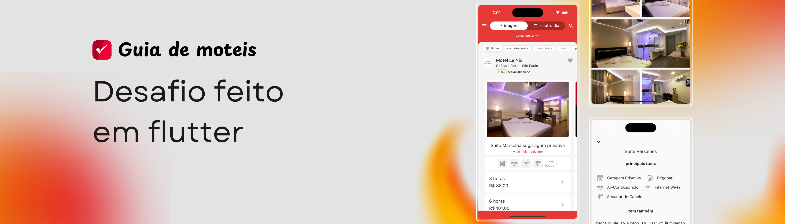

 

 

Desafio realizado com o intuito de clonar uma tela do aplicativo "Guia de moteis go". Feito em flutter utilizando as melhores práticas

---

## 📱 Aplicativo

<video width="100%" controls>
  <source src=".github/videos/example.mov">
</video>

## 🛠️ Como rodar

1. Certifique-se de ter o flutter 3.27.3 instalado, disponível em https://docs.flutter.dev/release/archive?tab=windows

2. Clone o projeto para a máquina local

3. No terminal na pasta [challenge_guia] do projeto rode `flutter pub get` para sincronizar as dependências do projeto

4. Ainda no terminal, rode o comando `flutter run` para rodar o projeto

## 📁 Estrutura de pastas

Foi utilizado o BLoC para o gerenciamento de estado, a estrutura do projeto ficou da seguinte maneira:

> business_logic: Blocs e Cubits

> core: Toda a parte utilitária e global do projeto(Temas, Helpers, e constantes)

> data: Responsável por adapters, data_sources, models, repositories e services

> routes: Parte de rotas nomeadas da aplicação

> ui: Parte visual da aplicação, ela contém as telas e widgets do aplicativo

## 📋 Checklist

[x] Código limpo e organizado

[x] Uso correto do Flutter e boas práticas

[x] Gerenciamento de estado eficiente

[x] Testes unitários cobrindo os componentes principais

[x] Boa experiência do usuário, ainda que o design não seja 100% fiel
